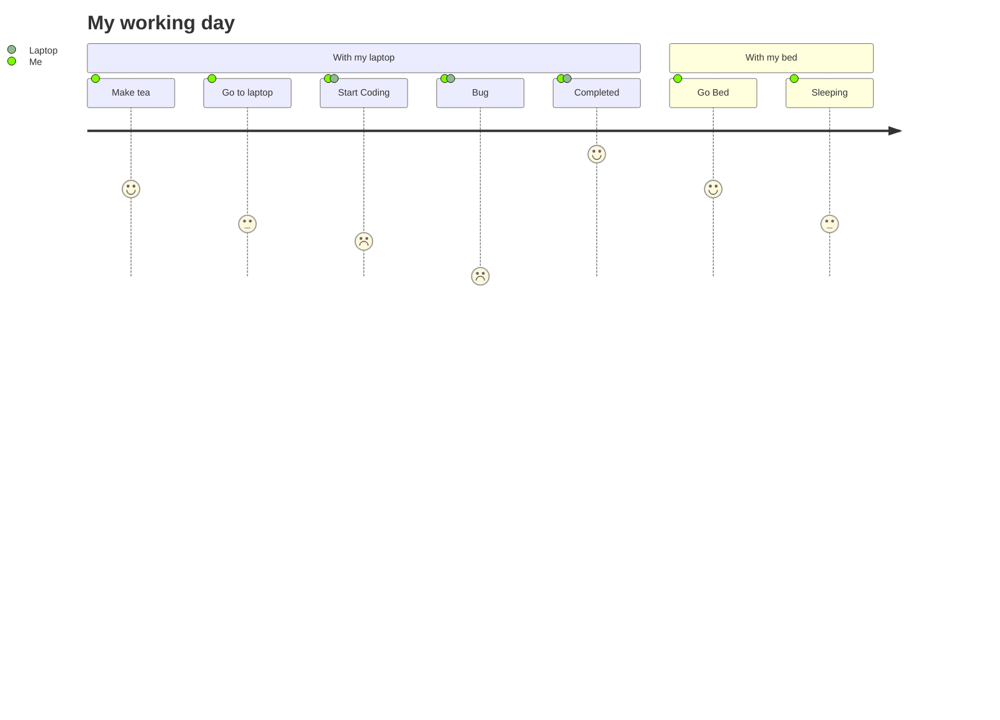

Hi 👋 Welcome to trustlelab's Profile!

## Software Engineer 

- Python, Ruby, Javascript, Typescript, .Net, Dart, Golang, Rust
- Node.js, Django, Flask, FastAPI, React, Next, Vue
- Docker, Kuberctl, Ubuntu, Debian, CentOs, KaliOs, Hosting, 
- Ecommerce, Wordpress, Zoho, Hubspot, CRM, Zapier
- AI Agent, Natural Language Processing, LLM, OpenAI, Llama, VectorDB, Langchain, llamaindex, Ollama
- Data Mining, Scraping, Automation, Analytics, Data processing
  

📫 How to reach me: 
Email : trustlelab@gmail.com

